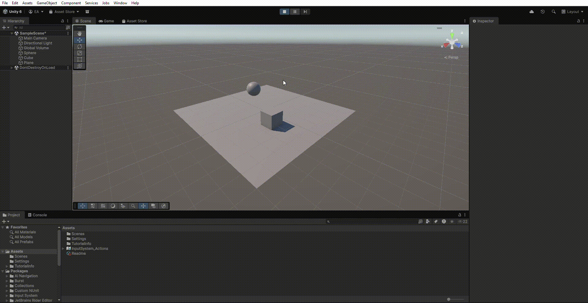
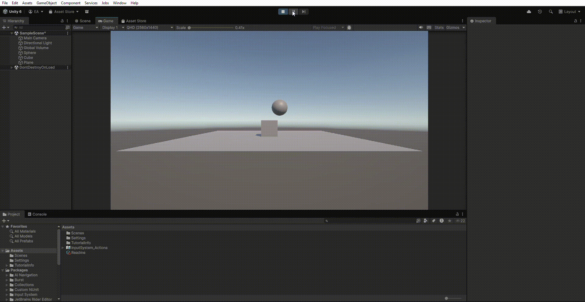
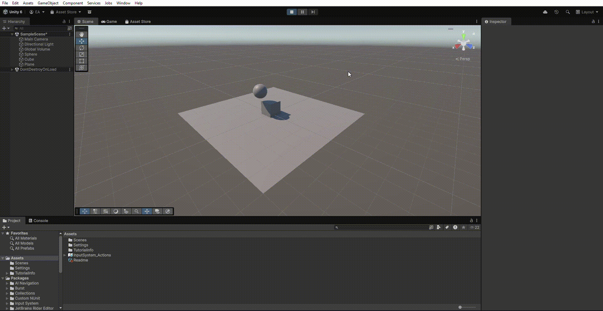
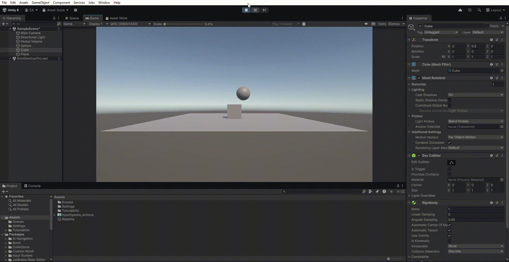
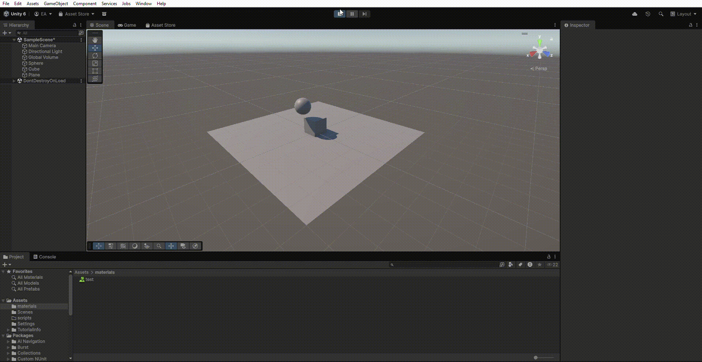
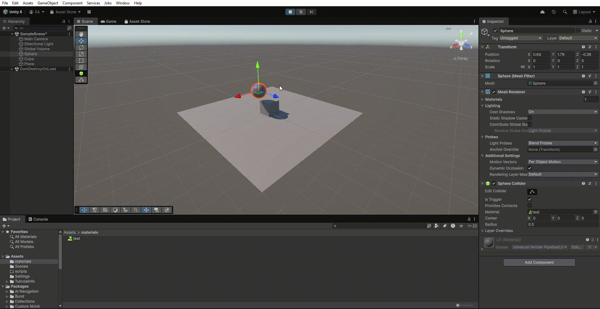
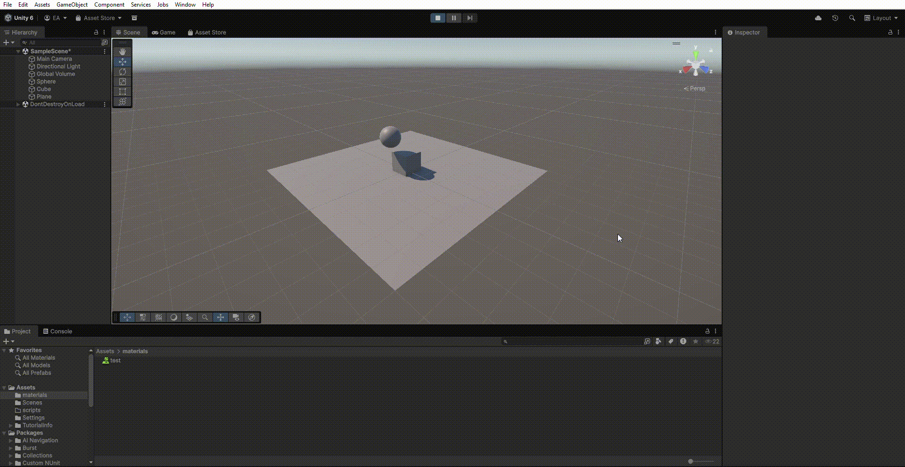
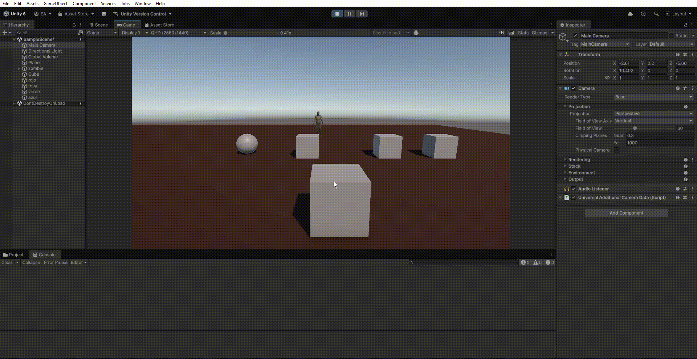
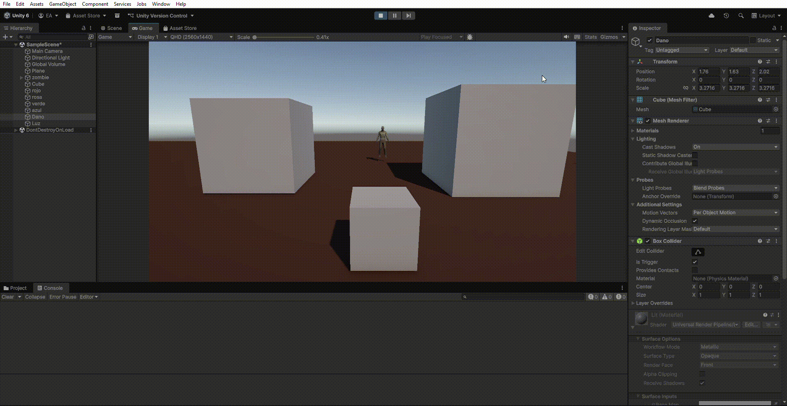
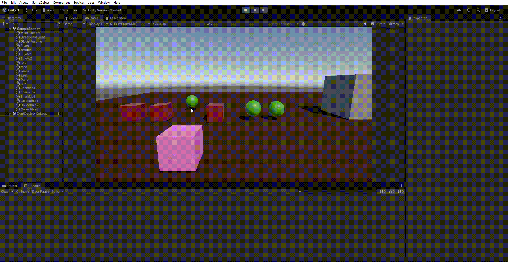

# Interfaces Inteligentes - Scripts Físicas 3D

- **Enmanuel Vegas Acosta** (alu0101281698)
- **Práctica 3**: Físicas 3D

## **Situaciones físicas 3D**

### **- Situación 1:**
_El plano no es un objeto físico. El cubo es un objeto físico y la esfera no. En este caso, el plano y la esfera sólo tendrán collider, mientras que el cubo debe tener Rigidbody._

El cubo cae y reposa sobre el plano. El cubo cuenta ahora con propiedades físicas
(`Rigidbody`), por lo que la gravedad le afectará. Sin embargo, el plano, que
solo tiene un `MeshColider`, actúa de 'límite'.

### **- Situación 2:**
_El plano no es un objeto físico. El cubo es un objeto físico y la esfera también. En este caso, el plano sólo tendrán collider, mientras que el cubo y la esfera deben tener Rigidbody._

La gravedad ahora afecta a la esfera también, que cae sobre el cubo.

### **- Situación 3:**
_El plano no es un objeto físico. El cubo es un objeto físico y la esfera es cinemática. En este caso, el plano sólo tendrán collider, mientras que el cubo y la esfera deben tener Rigidbody esta última cinemático._

A pesar de que la esfera es un objeto físico, la propiedad de ` isKinematic` permite que la física que no le afecte. Por lo tanto, se queda flotando.

### **- Situación 4:**
_El plano es un objeto físico. El cubo es un objeto físico y la esfera es física. En este caso, todos los objetos deben tener Rigidbody._

Como todos los objetos tienen `RigidBody`, todos ellos sucumben ante los efectos de la física. Todos caen al vacío.

### **- Situación 5:**
_El plano es un objeto físico. El cubo es un objeto físico y la esfera es física con 10 veces más masa que el cubo. En este caso, todos los objetos deben tener Rigidbody._

Mismo caso que el anterior.

### **- Situación 6:**
_El plano es un objeto físico. El cubo es un objeto físico y la esfera es física con 100 veces más masa que el cubo. En este caso, todos los objetos deben tener Rigidbody._

Mismo caso que la situación 4.

### **- Situación 7:**
_El plano es un objeto físico. El cubo es un objeto físico y la esfera es física con fricción. En este caso, todos los objetos deben tener Rigidbody._

Mismo caso que el anterior. El hecho de que el elemento tuviese asignado un material distinto no afectó en el resultado final.

### **- Situación 8:**
_El plano es un objeto físico. El cubo es un objeto físico y la esfera no es física y es Trigger. En este caso, todos los objetos deben tener Rigidbody._

En este caso la esfera no es afectada por la gravedad. Al eliminar el componente `RigidBody`, la esfera vuelve a su estado inicial.

### **- Situación 9:**
_El plano es un objeto físico. El cubo es un objeto físico y la esfera es física y es Trigger. En este caso, todos los objetos deben tener Rigidbody._

Todos los objetos son objetos físicos y con `IsKinetic = false`, por lo que están bajo los efectos del motor físico. El hecho de que la bola sea `Istrigger` o no es irrelevante a estos efectos.

## **Scripts Física 3D**

### **- Ejercicio 1:**
_Crea un personaje,controla su desplazamiento con las teclas WASD o las flechas, el movimiento debe estar influenciado por usando un Rigidbody, pero manteniendo el control total._ 

Para la realización de este ejercicio simplemente hemos hecho algo similar a lo realizado en la práctica anterior. Captamos el input del usuario y en base a eso sabemos cómo modificar la posición de nuestro objeto. Nuestro cubo tiene la propiedad `IsKinetic` activada, para mantener total control sobre el movimiento ejercido. [Ver script](/scripts/PlayerMovement.cs)

### **- Ejercicio 2:**
_Crea varios cubos o esferas con Rigidbody dinámico. Muestra por consola el nombre del objeto con el que colisiona, y cámbiale su color al colisionar._

En este caso hemos utilizado el método `OnCollisionEnter()` proporcionado por Unity. Este método se ejecuta cada vez que el objeto al que está vinculado colisiona con otro que también tenga un `MeshCollider`. [Ver script](/scripts/Colores.cs)

### **- Ejercicio 3:** 
_Crea una zona (por ejemplo, un cubo grande con Is Trigger = true). Al entrar, cambia el color del personaje o activa un efecto que cambie la luz. Al salir, revierte el cambio. Añade otra zona que aumente una variable daño._

Para este ejercicio hemos hecho uso de las funciones `OnTriggerEnter()` y `OnTriggerExit()` para detectar el momento en el que nuestro objeto entra, o sale, respectivamente, de las grandes cajas. [Ver script](scripts/DanoYLuz.cs)

### **- Ejercicio 4:**
_Crea tres tipos de objetos en capas distintas: jugador, enemigos, recolectables. Configura la Layer Collision Matrix (Project Settings > Physics). Haz que los enemigos solo colisionen con el jugador, y que los recolectables solo sean detectados por triggers._

En este caso tuvimos que acceder a las configuraciones anteriormente descritas (`Project Settings > Physics > Layer Collision Matrix`) para modificar las distintas capas de las que disponemos en nuestra escena. Podemos observar que los `enemigos` (cubos) no colisionan ni pueden interactuar con los objetos `coleccionables` (esferas). Sin embargo, el `jugador` sí que puede acceder e interactuar con ellas a través de su cualidad de `Trigger`. [Ver script enemigos](scripts/Enemigos.cs) y [Ver script coleccionables](scripts/Recolectables.cs).

## **- Ejercicio 5:**
_Crea una escena con distintos materiales físicos (resbaladizo, rugoso, rebote alto). Aplica distintos Physic Materials a objetos. Lanza los objetos con AddForce() al pulsar la tecla X y observa cómo cambian las reacciones._

En este último ejercicio se ha procedido a crear una pequeña jaula de cristal. Cada vez que se presiona la tecla 'x', los objetos con los nuevos materiales recibirán un impulso gracias al método `AddForce()`. Los cubos rosas son los que tienen el material 'saltarín' asignado. El elemento marrón es 'rugoso'. Por último, el cubo azul, tiene la propiedad 'Resbaladiza'. 

Podemos observar que estas propiedades afectan en gran medida cómo el objeto responde ante choques con otros elementos del entorno. [Ver script](/scripts/Colores.cs)

